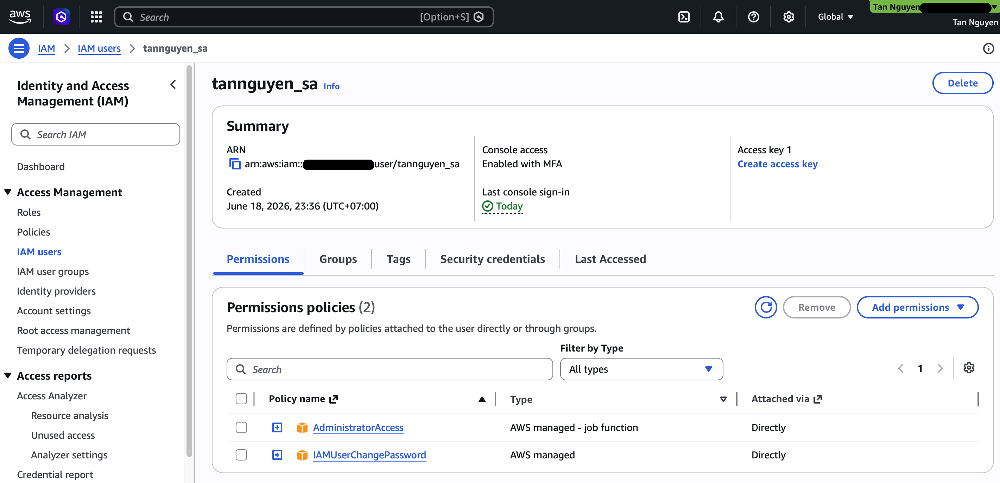
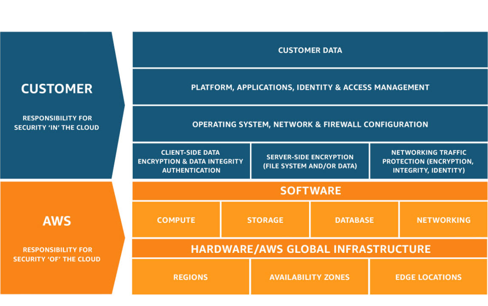

# 🛠 AWS Sandbox Environment Setup & Security Baseline

This document logs the initialization of the isolated AWS Sandbox environment and the implementation of enterprise-grade fiscal guardrails during Phase 0.

## 1. Environment Architecture

To comply with the AWS Security Pillar baseline, the environment enforces strict separation of privileges:

  **Root Account:** Identity secured via Multi-Factor Authentication (MFA). Credentials rotated and stored securely. Zero day-to-day operational usage.
*   **IAM Administrator User (`tannguyen-sa`):** Created with `AdministratorAccess` policy attached directly. All subsequent architectural testing, networking labs, and proof-of-concepts (PoCs) will execute under this identity.

## 2. Cost Control & Billing Guardrails

To eliminate the risk of unexpected cloud spend during migration simulation, an automated budget alert was provisioned via **AWS Billing and Cost Management**.

*   **Budget Type:** Cost Budget (Monthly tracking)
*   **Threshold Limit:** $5.00 USD
*   **Trigger Condition:** 100% of budgeted amount (Actual or Forecasted)
*   **Notification Channel:** Automated Email alert dispatched instantly to the primary account administrator upon breach.

## 3. Verification & Validation Metrics

*   [x] AWS Free Tier account successfully activated and verified by AWS.
*   [x] IAM User `tannguyen-sa` can authenticate successfully via the custom account console URL.
*   [x] Zero-spend / $5 budget threshold status verified as **Active** in the billing dashboard.

## 4. Architectural Appendix: Shared Responsibility Model

When advising enterprise clients, this framework defines the security boundaries between the cloud provider and the client infrastructure:

*   **AWS Responsibility (Security OF the Cloud):** Physical data center security, hardware, virtualization layer, and global infrastructure.
*   **Customer Responsibility (Security IN the Cloud):** Data encryption, IAM network access control configurations, and guest operating system patching.

---
*Documented by Tan Nguyen — Presales SA Track*
