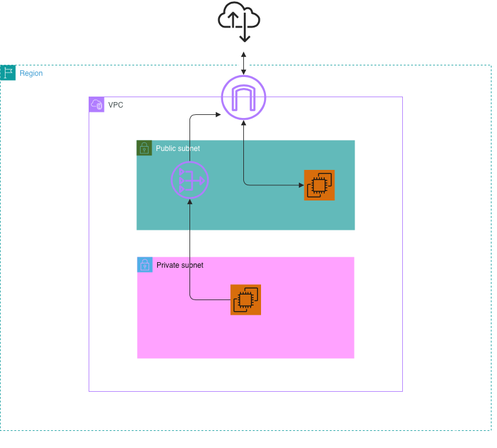

# 🗺 Routing, Internet Gateway, and NAT Gateway Architecture

This section documents the packet routing design implemented to enable secure internet egress for internal applications while maintaining a zero-ingress posture for private backends.

## 1. Routing & Egress Architecture Diagram

Below is the logical routing topology designed for PV***. It illustrates how inbound internet traffic is restricted to the public edge, while internal workloads utilize a managed NAT gateway for outbound updates.

## 2. Route Table Strategy

We enforce complete segregation of network maps by isolating public egress from private boundaries:

### A. Public Route Table (`rtb-pv***-public`)
*   **Associated Subnets:** `subnet-pv***-public-1a`
*   **Routing Target:** Direct attachment to `igw-pv***-prod` for bi-directional public internet access.

### B. Private Route Table (`rtb-pv***-private-hr`)
*   **Associated Subnets:** `subnet-pv***-private-hr-1a`
*   **Routing Target:** Egress-only routing mapped through `nat-pv***-public-1a` located in the public zone. Prevents direct inbound connection requests from the public web.

| Route Table Name | Destination | Target | Description |
| :--- | :--- | :--- | :--- |
| `rtb-pv***-public` | `10.0.0.0/16` `0.0.0.0/0` | `local` `igw-pv***-prod` | Internal communication Full public internet access |
| `rtb-pv***-private-hr` | `10.0.0.0/16` `0.0.0.0/0` | `local` `nat-pv***-public-1a` | Internal communication Outbound-only internet via NAT |

## 3. Presales Design Trade-offs (Architectural Notes)
*   **High Availability Configuration:** For actual enterprise production deployments, a single NAT Gateway creates a Single Point of Failure (SPOF). The design must evolve to feature one NAT Gateway per Availability Zone (Multi-AZ architecture).
*   **Cost Optimization (FinOps):** NAT Gateway incurs hourly costs and data processing fees. Monitored closely under the configured $5 Sandbox baseline.
