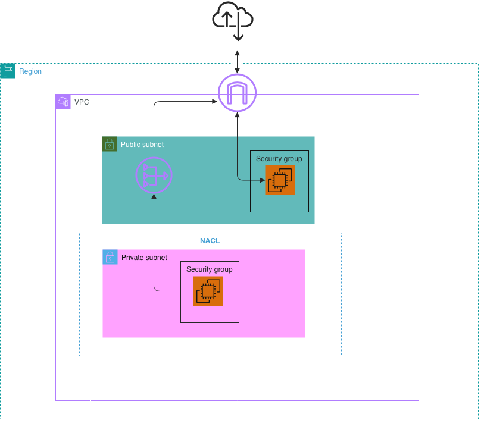

# 🔐 Security Group Architecture & Micro-segmentation Strategy

This document outlines the stateful firewall design implemented to protect PV***'s internal workloads (HR Workflows, Legal Automation, Sales Reporting) using a 3-tier security grouping strategy.

## 1. Network Security Layering Diagram (Defense-in-Depth)

To visually demonstrate our security perimeter to PV***'s CISO, the blueprint below illustrates the multi-layered defense architecture. It highlights how stateless perimeters (NACL) and stateful controls (Security Groups) collaborate to isolate infrastructure.

---

## 🛠️ SESSION 3 PRACTICAL LAB: STEP-BY-STEP IMPLEMENTATION

### Step 1: Provision Public Edge Security Group
1. Navigate to the **VPC Console** > **Security Groups** > Click **Create security group**.
2. Configure baseline details:
   * **Security group name:** `pv***-public-alb`
   * **Description:** Allow public web traffic (HTTP/HTTPS)
   * **VPC:** Select `vpc-pv***-prod`
3. **Inbound Rules:**
   * Add HTTP (Port 80) | Source: `0.0.0.0/0`
   * Add HTTPS (Port 443) | Source: `0.0.0.0/0`

### Step 2: Provision Tiered Private Security Group (SG Chaining)
1. Click **Create security group** again.
2. Configure isolation details:
   * **Security group name:** `pv***-app-private`
   * **Description:** Allow traffic exclusively from the Public ALB
   * **VPC:** Select `vpc-pv***-prod`
3. **Inbound Rules:**
   * Add Custom TCP | Port Range: `8080`
   * **Source:** Select/Type the Security Group ID of `pv***-public-alb` (Enforces strict tier-to-tier binding).

### Step 3: Configure Network ACL (NACL) for Explicit Perimeter Deny
To mitigate the risk of targeted DDoS attacks from known malicious actors before traffic reaches the instances, configure stateless perimeter filtering:
1. In the **VPC Console** left menu, select **Network ACLs** > Click **Create network ACL**.
   * **Name tag:** `nacl-pv***-private`
   * **VPC:** Select `vpc-pv***-prod`
2. **Inbound Rules Configuration** (Evaluated top-to-bottom sequentially):
   * Click **Edit inbound rules** > Click **Add new rule**.
   * **Rule #100:** *Type:* All traffic | *Source:* `1.2.3.4/32` | *Allow/Deny:* **DENY** *(Intercepts and drops malicious traffic at the subnet boundary).*
   * **Rule #200:** *Type:* All traffic | *Source:* `0.0.0.0/0` | *Allow/Deny:* **ALLOW** *(Permits all remaining legitimate user traffic).*
3. **Subnet Associations:**
   * Navigate to the **Subnet associations** tab > Click **Edit subnet associations**.
   * Select `subnet-pv***-private-hr-1a` to bind the stateless firewall to the targeted workload zone.

### Step 4: Architectural Diagramming on Draw.io
To align with Presales SA documentation standards, execute the following diagramming steps:
1. Open your existing network architecture file on **Draw.io**.
2. **Isolate the Subnet Perimeter (NACL):** Draw a dashed boundary around the Private Subnet and place an AWS NACL icon on the border. Map an explicit `DENY` path for malicious actor IP `1.2.3.4/32`.
3. **Isolate the Host Perimeter (Security Group):** Draw a solid bounding box wrapper around the EC2 instance inside the Private Subnet, labeling it `pv***-app-private`.
4. Export the final diagram as `pv***-security-layers.png` and save it directly into the `/diagrams` root directory.

---

## 2. Multi-Tier Security Group Mapping

| Security Group Name | Inbound Allowed Ports | Source / Trust Boundary | Architectural Purpose |
| :--- | :--- | :--- | :--- |
| `pv***-public-alb` | `80` (HTTP), `443` (HTTPS) | `0.0.0.0/0` (Anywhere) | Handles public-facing traffic for dealer and customer web portals. |
| `pv***-app-private` | `8080` (App Custom Port) | `pv***-public-alb` (SG ID) | Isolates core business logic (HR & Legal apps). Rejects direct internet ingress. |

## 3. Verification Metrics & Deflection Logic
* [x] Stateless perimeter fence simulation completed (NACL Deny rule mapping).
* [x] Stateful instance-level security groups successfully chained via Security Group IDs.