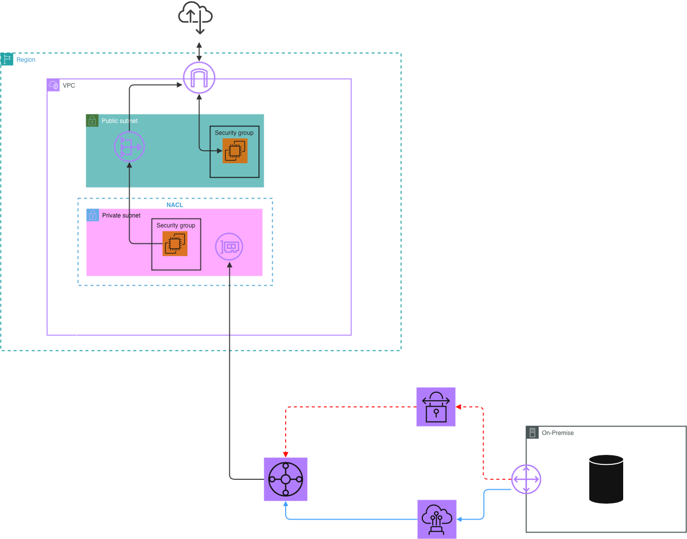

# 🏢 Hybrid Connectivity Design: On-Premise to AWS (PV*** Case Study)

This document evaluates and designs the hybrid network infrastructure connecting PV***'s on-premise data centers (ERP/SAP production) to the AWS Cloud environment (`vpc-pv***-prod`).

## 1. Architectural Options Comparison (Presales Matrix)

To align with PV***'s enterprise compliance, latency requirements for financial reporting, and cost efficiency targets, three technical paths were evaluated:

### Summary Comparison Table
* **Site-to-Site VPN:** Selected as the immediate, cost-effective backup path (Failover).
* **Direct Connect (DX):** Selected as the primary connection path for mission-critical SAP application data replication due to predictable throughput and ultra-low latency.
* **Transit Gateway (TGW):** Implemented centrally to simplify multi-VPC routing topologies as the architecture scales across multiple operational departments (HR, Legal, Sales).

## 2. Hybrid Network Topology (Hub-and-Spoke Pattern)

Below is the interconnected blueprint documenting how PV***'s physical corporate network bridges securely into the AWS Cloud environment using a high-availability network topology.

## 3. FinOps & Reliability Implementation Strategy

* **High Availability (HA):** To achieve a $99.9\%$ SLA for PV***, we implement a hybrid redundant architecture: Direct Connect acts as the active primary highway, while an AWS Site-to-Site VPN serves as an automated failover tunnel via BGP (Border Gateway Protocol) routing definitions.
* **Cost Management:** Transit Gateway data processing fees are optimized by keeping localized VPC-to-VPC cross-AZ traffic contained via VPC Endpoints where applicable, routing only external corporate-bound payloads through the TGW hub.

---
*Prepared by Tan Nguyen — Presales SA Track*